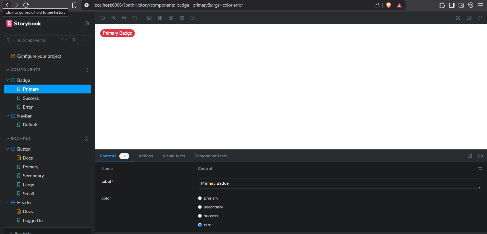

# 🎨 Design System Assignment

A reusable and scalable Design System built with **React + TypeScript + TailwindCSS + Storybook**.  
This project covers **Color System**, **Data Display Components**, and **Navigation Components**.

---

## 📚 Tech Stack

- React
- TypeScript
- TailwindCSS
- Storybook
- Chromatic (Deployment)

---

## 📦 Folder Structure


✅ Each component has its own folder with code and stories.

---

## ✨ Features

- **Color Tokens** for Light and Dark Themes
- **Accessible** and **Keyboard Navigable** Components
- **Reusable** and **Enterprise-ready** Components
- **Storybook** Documentation with States and Variants
- **WCAG Compliant** Contrast Ratios

---

## 🚀 Getting Started

1. Clone the repository:

```bash
git clone https://github.com/Hari-hara7/Design-System.git
cd design-system-assignment/app
```


##  🌐 Deployment
##  Deployed via Chromatic.

##  🔗 Live Storybook Link

(https://680f03b7999b06cd45fefa2f-dxyajcnhdf.chromatic.com/)

## 🖼 Screenshots

Here are some preview screenshots of the Design System:

| Storybook Home | Components View |
|:--------------:|:---------------:|
|  |  |


