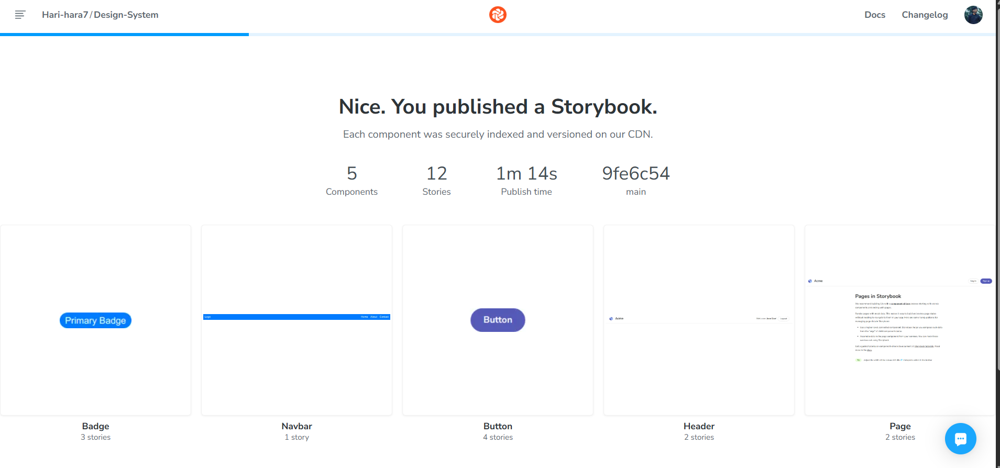

# 🎨 Design System Assignment

A reusable and scalable Design System built with **React + TypeScript + CSS + Storybook**.  
This project covers **Color System**, **Data Display Components**, and **Navigation Components**.

---

## 📚 Tech Stack

- React
- TypeScript
- TailwindCSS
- Storybook
- Chromatic (Deployment)

---

## 📦 Folder Structure


✅ Each component has its own folder with code and stories.

---

## ✨ Features

- **Color Tokens** for Light and Dark Themes
- **Accessible** and **Keyboard Navigable** Components
- **Reusable** and **Enterprise-ready** Components
- **Storybook** Documentation with States and Variants
- **WCAG Compliant** Contrast Ratios

---

### Accordion

The Accordion component allows users to expand or collapse sections of content. It is ideal for grouping content that can be toggled, such as FAQs, lists, or other types of collapsible content.

#### Props

| Prop         | Type         | Description                                      |
|--------------|--------------|--------------------------------------------------|
| `isOpen`     | `boolean`    | Controls the visibility of the accordion section. |
| `title`      | `string`     | The title of the accordion section.             |
| `onToggle`   | `function`   | Callback function triggered on accordion toggle. |

#### Use Cases

- FAQs section on a website.
- Collapsible panels in dashboards or admin panels.
- Hiding large chunks of text in blogs.

#### Anatomy of Accordion

1. **Header**: Contains the title of the accordion.
2. **Body**: Contains the expandable content (hidden or shown based on `isOpen` state).
3. **Toggle Button**: Trigger to expand or collapse the section.

#### States & Variants

- **Default State**: Accordion section is collapsed.
- **Expanded State**: When the accordion is open, the section content is visible.
- **Hover State**: The header highlights when hovered.
- **Disabled State**: The accordion cannot be toggled.

#### Interaction Behavior

- **Clicking** on the accordion header will toggle the content visibility.
- **Keyboard Navigation**: Press `Enter` or `Space` to toggle the accordion on keyboard focus.
- **Focus Management**: Focus remains on the clicked accordion header after toggle.

#### Accessibility Notes

- **ARIA Role**: Use `aria-expanded="true|false"` to indicate the visibility of the content.
- **Keyboard Navigation**: Allow toggling with `Enter` and `Space` keys.
- **Focus Management**: Focus remains on the accordion header after interaction.
- **Accessible Labeling**: Use `aria-labelledby` for the header to improve screen reader interaction.

#### Theming / Responsiveness

- The component supports both **light** and **dark** themes, with color tokens for proper contrast.
- It is **fully responsive**, ensuring proper alignment and sizing on small screens (mobile) and large screens (desktop).

#### Do's and Don'ts

##### Do’s:
- Use the accordion for grouping related content.
- Ensure the accordion is used in places where toggling between different sections is helpful for users.

##### Don’ts:
- Don’t use an accordion for large amounts of content that require scrolling.
- Avoid nesting accordions inside other accordions; it can cause confusion for users.


## 🚀 Getting Started

1. Clone the repository:

```bash
git clone https://github.com/Hari-hara7/Design-System.git
cd design-system-assignment/app
```


##  🌐 Deployment
##  Deployed via Chromatic.

##  🔗 Live Storybook Link

(https://680f03b7999b06cd45fefa2f-dxyajcnhdf.chromatic.com/)

## 🖼 Screenshots

Here are some preview screenshots of the Design System:

| Storybook Home | Components View |
|:--------------:|:---------------:|
|  |  |


